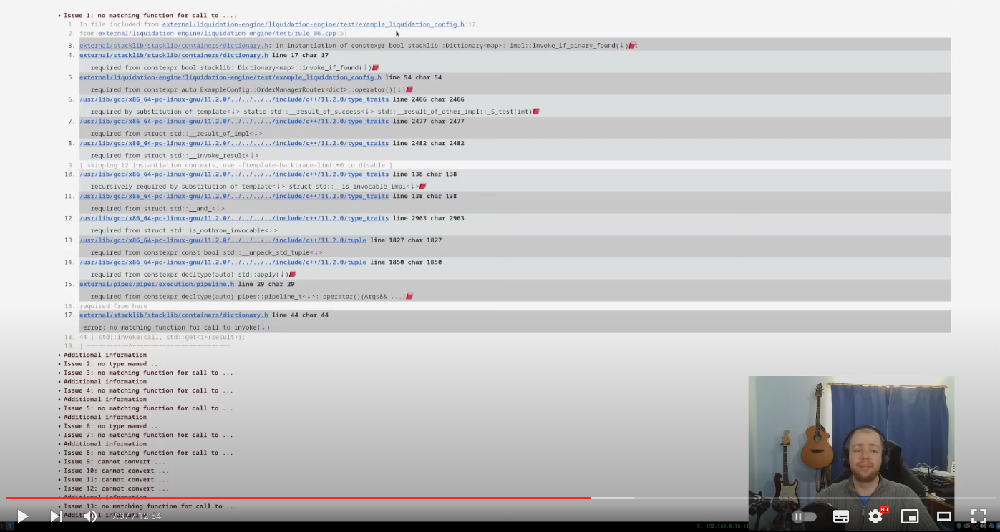

# gcc-explorer

A browser based tool to make [GCC](https://gcc.gnu.org/) build logs easier to read, with emphasize on
highlighting various build warnings. GCC has a tendency to spit out a lot of
warnings while building, and as the build output is very verbose, developers
tend to ignore/miss the warnings as they don't fail the build and to not stick
out. With this visual tool exploring the warnings is a lot easier.

Currently hosted at https://theoreticallyphysics.com/gcc-explorer, but feel free
to clone or fork and run your own instance.

For more information see the following videos:

* [GCC Explorer - Episode 1: A utility for exploring GCC error logs](https://www.youtube.com/watch?v=cKLPlHHa7vk)
* [GCC Explorer - Episode 2: Stylistic and functional improvements](https://www.youtube.com/watch?v=EKbYUO9tJVo)
